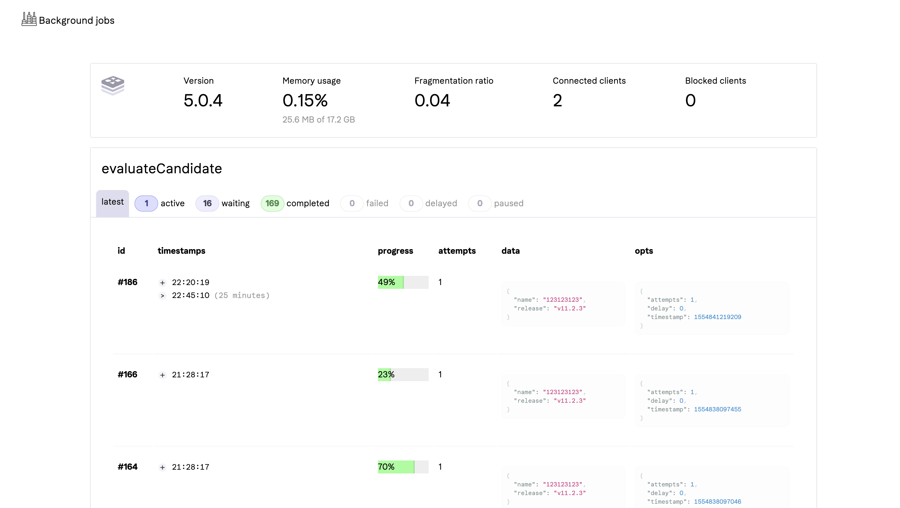

# bulls-eye 🎯

This package provides a queue manager and a UI to inspect jobs. The manager is based on [bull](https://github.com/OptimalBits/bull) and it depends on redis.

## Architecture

Before using bulls-eye, please consider if it is the right solution for your problem. Here's a bunch of cool things it can do:

- Run arbitrary or scheduled (like in cron) jobs in the background.
- Set prios, retry, pause, resume and limit the rate of your jobs.
- Concurrently run in a sandboxed process that will not crash your app.
- Render a UI in your app with all the info you'll need to manage the jobs.

Most background jobs tools depend on multiple processes to work. This means you would need to use something like a Procfile to keep your server and all your workers running. bulls-eye will use your node service process as the manager of executions and (if you so wish) spawn child processes in your instances to deal with the workload.

On the other hand this is also one of its disadvantages. That is, you probably should not use bulls-eye if:

- you can't afford your server to be doing something else than serving requests.
  - in this case, consider having a separate service to be a queue manager, or lambdas.
- you need to aggressively scale your workers independently of your instances.
  - in this case, probably lambdas.
- all you need is a simple cron job (UI is just a luxury).
  - use a cron job. perhaps [node-cron](https://www.npmjs.com/package/node-cron)?

## Hello world

```js
const { createQueues, UI } = require('bulls-eye')

const queues = createQueues(redisConfig) // sets up your queues

const helloQueue = queues.add('helloQueue') // adds a queue

helloQueue.process(async job => {
  console.log(`Hello ${job.data.hello}`)
}) // defines how the queue works

helloQueue.add({ hello: 'world' }) // adds a job to the queue

app.use('/queues', UI) // serves the UI at /queues, don't forget authentication!
```

## Further ref

For further ref, please check [bull's docs](https://github.com/OptimalBits/bull). Appart from the way you config and start your UI, this library doesn't hijack bull's way of working.

## UI


