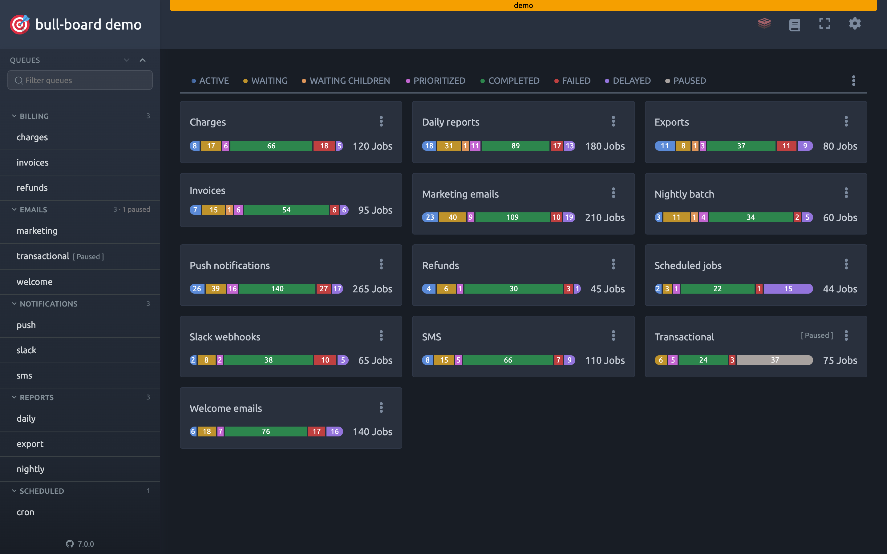

#  @bull-board

Dashboard UI for [Bull](https://github.com/OptimalBits/bull) and [BullMQ](https://github.com/taskforcesh/bullmq) job queues. Plug it into your server, see your queues.

<p align="center">
  <a href="https://www.npmjs.com/org/bull-board">
    
  </a>
  <a href="https://github.com/felixmosh/bull-board/blob/master/LICENSE">
    
  </a>
  
</p>



## Documentation

The [docs](https://felixmosh.github.io/bull-board/) have guides, recipes, the UIConfig reference, and per-adapter setup. There's also a [live demo](https://felixmosh.github.io/bull-board/demo/).

## Install

Pick the adapter for your framework:

```sh
npm install @bull-board/api @bull-board/express
# or @bull-board/fastify, @bull-board/koa, @bull-board/hapi,
# @bull-board/nestjs, @bull-board/hono, @bull-board/h3,
# @bull-board/elysia, @bull-board/bun
```

## Minimal Express example

```js
const express = require('express');
const { Queue } = require('bullmq');
const { createBullBoard } = require('@bull-board/api');
const { BullMQAdapter } = require('@bull-board/api/bullMQAdapter');
const { ExpressAdapter } = require('@bull-board/express');

const queue = new Queue('emails', { connection: { host: 'localhost', port: 6379 } });

const serverAdapter = new ExpressAdapter();
serverAdapter.setBasePath('/admin/queues');

createBullBoard({
  queues: [new BullMQAdapter(queue)],
  serverAdapter,
});

const app = express();
app.use('/admin/queues', serverAdapter.getRouter());
app.listen(3000, () => console.log('http://localhost:3000/admin/queues'));
```

Every other adapter follows the same pattern: build your queues, wrap them in an adapter, mount the router. See the [adapter pages](https://felixmosh.github.io/bull-board/adapters/) for framework-specific wiring.

## Packages

| Name                                                                     | Version                                                           |
|--------------------------------------------------------------------------|-------------------------------------------------------------------|
| [@bull-board/api](https://www.npmjs.com/package/@bull-board/api)         |               |
| [@bull-board/ui](https://www.npmjs.com/package/@bull-board/ui)           |                |
| [@bull-board/express](https://www.npmjs.com/package/@bull-board/express) |           |
| [@bull-board/fastify](https://www.npmjs.com/package/@bull-board/fastify) |           |
| [@bull-board/koa](https://www.npmjs.com/package/@bull-board/koa)         |               |
| [@bull-board/hapi](https://www.npmjs.com/package/@bull-board/hapi)       |              |
| [@bull-board/nestjs](https://www.npmjs.com/package/@bull-board/nestjs)   |            |
| [@bull-board/hono](https://www.npmjs.com/package/@bull-board/hono)       |              |
| [@bull-board/h3](https://www.npmjs.com/package/@bull-board/h3)           |                |
| [@bull-board/elysia](https://www.npmjs.com/package/@bull-board/elysia)   |            |
| [@bull-board/bun](https://www.npmjs.com/package/@bull-board/bun)         |               |

## Contributing

Issues and PRs welcome. Check the [issues page](https://github.com/felixmosh/bull-board/issues) before opening a new one. When reporting a bug, include versions (Node, Redis, Bull/BullMQ, bull-board) and a minimal reproduction.

To develop locally:

```sh
git clone git@github.com:felixmosh/bull-board.git
cd bull-board
yarn && yarn build && yarn dev
```

Requires Redis running on `6379`. Dev server opens at `http://localhost:3000/ui`.

## Acknowledgements

- [Juan](https://github.com/joaomilho) for building the first version of this library.

## License

[MIT](https://github.com/felixmosh/bull-board/blob/master/LICENSE).
